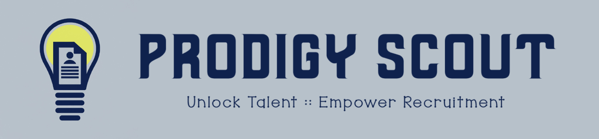

# Prodigy Scout

## Team 09: Members

- Mason Myers & Steve de Sa

## Product Vision

- Our web app revolutionizes the recruitment process by providing recruiters with comprehensive profiles of students attending career fairs. Through our platform, recruiters gain valuable insights into students' skills and backgrounds, enabling them to make informed decisions and establish meaningful connections before the event. By facilitating proactive engagement between recruiters and students, we aim to optimize the recruitment process for both parties.

## Value Proposition

- Our web app empowers recruiters to make the most of career fairs by offering them access to detailed student profiles beforehand. By providing insights into students' skills and backgrounds, recruiters can identify promising candidates and engage with them proactively. With features such as messaging and commenting, recruiters can establish meaningful connections early on, saving time and resources while maximizing recruitment outcomes.
